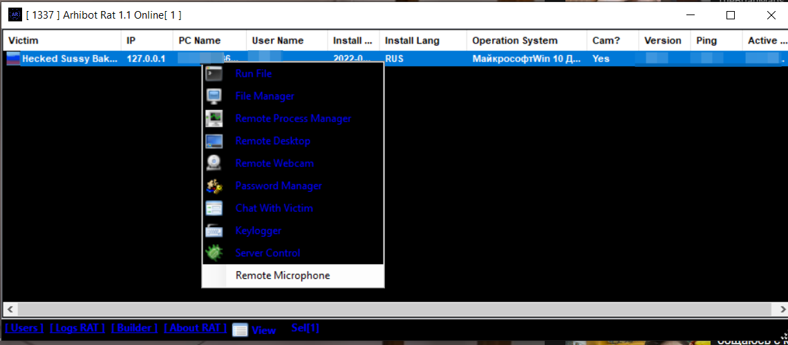

# Arhibot-Rat

Arhibot Rat - Remote Administration Tool for Windows
Arhibot Rat - Инструмент для удаленного доступа к ПК

# Disclaimer /  Дисклеймер
Your attention is provided with remote administration tool. Arhibot Rat is for education and research purposes only. Creators WON'T BE RESPONSIBLE for any damages / losses, created by this tool. You can use this software, but you understand that you this use on your own and risk.

Вашему вниманию предоставляется инструмент для удаленного доступа к компьютеру. Arhibot Rat предназначен для ознакомительных целях. Создатели не будут нести ответственности за любой ущерб, причиненым этим инструментом. Вы можете пользоваться этим инструментом, но вы осознаете что вы используйте его на свой страх и риск.

## Contents / Содержимое
- [About RAT](#about-rat) Об программе
- [Features of RAT](#Features) Фишки и особенности
- [How to use?](#Quick-start) Как пользоваться? Быстрый старт для новичков
- [Demonstration](#demonstration) Демонстрация

## Features

Arhibot RAT 1.0                         
|:----------------|              
| `Remote Desktop`|  
| `File Manager`  |  
| `Keylogger`     |  
| `Process Manage`|  
| `Passwords`     |  
| `Fun Menu`      |  
| `TextToSpeech`  |  
| `Restart`       |  
| `Shutdown`      |  
| `Monitor`       |  
| `Builder`       |             
| `Multi Client`  |

Arhibot RAT 1.1                 
|:----------------|
| `Remote Desktop`|
| `Remote WebCam`|
| `Remote Microphone`|
| `Run File`|
| `Script`|
| `Process Manager`|
| `File Manager`|
| `Remote Shell`|
| `Remote Regedit`|
| `Chat`|
| `Builder`|
| `Passwords`|
| `Open Folder`|
| `Keylogger`|
| `Restart`       |
| `Shutdown`      |
| `Monitor`       |
| `Multi Client`  |                     

## Quick-start
Download Arhibot Rat:

1. Click "Code" and choose "Download Zip"
2. Before download, turn off your antivirus software, because he lock his work and app didn't will work correctly.
3. Open Folder for Versions (Open Folder Arhibot Rat EN for English Version, Open Folder Arhibot Rat RUS for Russian Version)
4. If you opened first version, just open app. If you opened second version, DON'T DELETE .DLL FILES! They is very important for remote microphone and webcam.
Ready!

Port:
1. (In first version) - Click the button "Listener" and enter your port "In my case is 1337". Click Start, ready!
2. If client didn't connected, you need NO-IP.

How to Open Ports?

For opening ports you need No-IP or HideMyName VPN

Builder:

In First Version:
1. Click the button "Builder"
2. Enter the IP / No-IP, your started port
3. You can setup for your virus special functions. Example: Copy to StartUp, Anti Kill, etc. (at your discretion)
4. After setup, click "Build!", choose directory where you want to save the virus, ready!

In Second Version:
1. Click the link "Builder" bellow
2. Do the same. (optional) you can set for your virus icon.
3. Ready!

# demonstration

